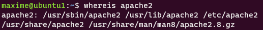
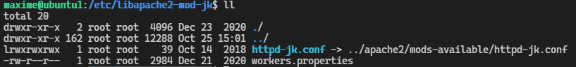
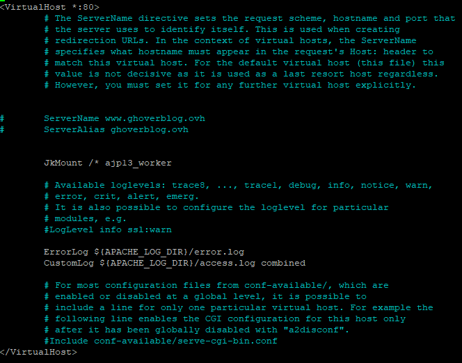
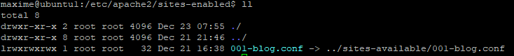
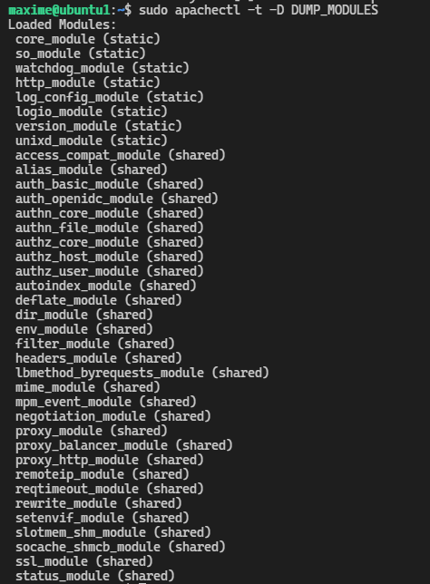

5. Apache serveur
#################

Installation d'apache serveur
-----------------------------

Voici la commande d'installation d'apache sur le serveur Ubnutu_1

.. code-block:: bash
    :linenos:

    sudo apt-get install apache2

Connaitre la localisation de fichier d'apache serveur (apache2)

.. code-block:: bash
    :linenos:

     cd /etc/apache2/

1. Liste de commande rapide
=============================

.. code-block:: bash
    :linenos:

    sudo service apache2 status
    sudo service apache2 start
    sudo service apache2 stop
    sudo service apache2 restart
    sudo service apache2 reload

Une fois apache installé, vous pouvez configuré plus type configuration. Dans ce document, 
je vais exposé une configuration qui permettra de la gestion des flux vers une application ``Tomcat``
Le paramétrage ce fera via le module JK. 
Puis, j'exposerais la configration utilsé pour la mise en production du site ``ghoverblog``

Gestion Module mod_jk pour Tomcat
----------------------------------

1. Installation et activation du modul jk
====================================================

C'est du côté Apache que se fait l'essentiel du travail. 
Par défaut, Apache ne connaît pas le protocole JServ (AJP). 
On va lui ajouter un module nommé  ``mod_jk`` `(des info ici) <https://tomcat.apache.org/tomcat-3.3-doc/mod_jk-howto.html>`_ 
pour l'enrichir de cette possibilté.

L'ajout d'un module consiste à faire charger par Apache une (ou plusieurs) librairies 
dynamiques lors de son lancement. Là encore, le gestionnaire de paquets nous apporte 
une aide précieuse.

Entré les commandes suivantes pour l'installer

.. code-block:: bash
    :linenos:

    sudo apt install libapache2-mod-jk

Pour vérifier l'intallation du module ``mod_jk``, allez sur le sous-répertoire ci-dessous
et vérifier la présence du fichier ``jk.load``

.. code-block:: bash
    :linenos:

    cd /etc/apache2/mods-enabled

2. Configuration prox revers avec le module (jk mod_jk)
========================================================

Liste des étapes a réaliser pour la configuration d'un proxy avec le ``mod_jk``

- Paraméter le fichier worker.properties
- Activer le module de httpd.conf pour le chargement par apache
- Déclarer les prefixes de l’url vers tomcat
- Activer les prefixes dans apache

Les fichiers concernant le module JK ce trouve dans le repertoire

.. code-block:: bash
    :linenos:

    cd /etc/libapache2-mod-jk

Voici une image des fichiers si trouvant 

3. Le fichier worker.properties
================================

Avant de ce lancer dans les modification du fichier de properties, il faut que vous ayez 
configuré le serveur Tomact. 
Le secret qui doit étre renseigner dans la parti ``worker.ajp13_worker.secret``
de ce fichier ce trouve dans le fichier ``server.xml`` voir dans la documentation parti 
Tomact => Configuration du module jk. 
Il faut donc, paramétre tomcat le complet possible afin d'arriver sur cette section avec 
un max de paramétre finalisé.

`Un worker <http://eost.u-strasbg.fr/manual/fr/mod/worker.html>`_ est pour le serveur Apache, 
une instance de Tomcat qui attend les requêtes qu'il lui délivre. Il est possible de déclarer plusieurs workers. 
Dans ce cas, chaque worker aura son propre fichier de properties.

Une fois paramétre votre worker, il doit étre déclaré dans le fichier de configuration 
fesant référence a tout les workers ``httpd-jk.conf``. Il sera décrit au chapitre suivant.

.. code-block:: bash
    :linenos:

    sudo nano /etc/libapache2-mod-jk/workers.properties

Dans ce fichier, un certain nombre paramétre ont était ajouté comme la référence du path de
tomcat ainsi la référence du path de la JVM. Voici un exemple complet.

.. code-block:: bash
    :linenos:

    # workers.properties -
    #
    # This file is a simplified version of the workers.properties supplied
    # with the upstream sources. The jni inprocess worker (not build in the
    # debian package) section and the ajp12 (deprecated) section are removed.
    #
    # As a general note, the characters $( and ) are used internally to define
    # macros. Do not use them in your own configuration!!!
    #
    # Whenever you see a set of lines such as:
    # x=value
    # y=$(x)\something
    #
    # the final value for y will be value\something
    #
    # Normaly all you will need to do is un-comment and modify the first three
    # properties, i.e. workers.tomcat_home, workers.java_home and ps.
    # Most of the configuration is derived from these.
    #
    # When you are done updating workers.tomcat_home, workers.java_home and ps
    # you should have 3 workers configured:
    #
    # - An ajp13 worker that connects to localhost:8009
    # - A load balancer worker
    #
    #

    # OPTIONS ( very important for jni mode )

    #
    # workers.tomcat_home should point to the location where you
    # installed tomcat. This is where you have your conf, webapps and lib
    # directories.
    #
    workers.tomcat_home=/var/lib/tomcat9

    #
    # workers.java_home should point to your Java installation. Normally
    # you should have a bin and lib directories beneath it.
    #
    workers.java_home=/usr/lib/jvm/java-11-openjdk-amd64

    #
    # You should configure your environment slash... ps=\ on NT and / on UNIX
    # and maybe something different elsewhere.
    #
    ps=/
    
    #
    #------ ADVANCED MODE ------------------------------------------------
    #---------------------------------------------------------------------
    #

    #
    #------ worker list ------------------------------------------
    #---------------------------------------------------------------------
    #
    #
    # The workers that your plugins should create and work with
    #
    worker.list=ajp13_worker

    #
    #------ ajp13_worker WORKER DEFINITION ------------------------------
    #---------------------------------------------------------------------
    #

    #
    # Defining a worker named ajp13_worker and of type ajp13
    # Note that the name and the type do not have to match.
    #
    worker.ajp13_worker.port=8009
    worker.ajp13_worker.host=127.0.0.1
    worker.ajp13_worker.type=ajp13
    worker.ajp13_worker.secret=root

    #
    # Specifies the load balance factor when used with
    # a load balancing worker.
    # Note:
    #  ----> lbfactor must be > 0
    #  ----> Low lbfactor means less work done by the worker.
    worker.ajp13_worker.lbfactor=1

    #
    # Specify the size of the open connection cache.
    #worker.ajp13_worker.cachesize

    #
    #------ DEFAULT LOAD BALANCER WORKER DEFINITION ----------------------
    #---------------------------------------------------------------------
    #

    #
    # The loadbalancer (type lb) workers perform wighted round-robin
    # load balancing with sticky sessions.
    # Note:
    #  ----> If a worker dies, the load balancer will check its state
    #        once in a while. Until then all work is redirected to peer
    #        workers.
    worker.loadbalancer.type=lb
    worker.loadbalancer.balance_workers=ajp13_worker

Pour en savoir plus sur la configuration de ``Tomact`` voir la section le concernant puis la parti 
Configuration du ``module jk``.

4. Le fichier de configuration httpd-jk.conf
=============================================

Ce fichier permettra de localiser le fichier ``worker.properties`` de situé le log et son le level
et bien autre paramétre.

Il ce trouve dans le repertoire ci-dessous

.. code-block:: bash
    :linenos:

    sudo nano /etc/apache2/mods-available/httpd-jk.conf

Voici un exemple complet de fichier paramétré qui permettre de le comprendre pour l'ajusté 
au besoin.

.. code-block:: bash
    :linenos:

    <IfModule jk_module>

    # We need a workers file exactly once
    # and in the global server
    JkWorkersFile /etc/libapache2-mod-jk/workers.properties

    # Our JK error log
    # You can (and should) use rotatelogs here
    JkLogFile /var/log/apache2/mod_jk.log

    # Our JK log level (trace,debug,info,warn,error)
    JkLogLevel war

    # Our JK shared memory file
    JkShmFile /var/log/apache2/jk-runtime-status

    # Define a new log format you can use in any CustomLog in order
    # to add mod_jk specific information to your access log.
    # LogFormat "%h %l %u %t \"%r\" %>s %b \"%{Referer}i\" \"%{User-Agent}i\" \"%{Cookie}i\" \"%{Set-Cookie}o\" %{pid}P %{tid}P %{JK_LB_FIRST_NAME}n %{JK_LB_LAST_NAME}n ACC %{JK_LB>
    # This option will reject all requests, which contain an
    # encoded percent sign (%25) or backslash (%5C) in the URL
    # If you are sure, that your webapp doesn't use such
    # URLs, enable the option to prevent double encoding attacks.
    # Since: 1.2.24
    # JkOptions +RejectUnsafeURI

    # After setting JkStripSession to "On", mod_jk will
    # strip all ";jsessionid=..." from request URLs it
    # does *not* forward to a backend.
    # This is useful, if all links in a webapp use
    # URLencoded session IDs and parts of the static
    # content should be delivered directly by Apache.
    # Of course you can also do it with mod_rewrite.
    # Since: 1.2.21
    # JkStripSession On

    # Start a separate thread for internal tasks like
    # idle connection probing, connection pool resizing
    # and load value decay.
    # Run these tasks every JkWatchdogInterval seconds.
    # Since: 1.2.27
    JkWatchdogInterval 60

    # Configure access to jk-status and jk-manager
    # If you want to make this available in a virtual host,
    # either move this block into the virtual host
    # or copy it logically there by including "JkMountCopy On"
    # in the virtual host.
    # Add an appropriate authentication method here!

      <Location /jk-status>
        # Inside Location we can omit the URL in JkMount
        JkMount jk-status
        Require ip 127.0.0.1
    </Location>
    <Location /jk-manager>
        # Inside Location we can omit the URL in JkMount
        JkMount jk-manager
        Require ip 127.0.0.1
    </Location>

    # If you want to put all mounts into an external file
    # that gets reloaded automatically after changes
    # (with a default latency of 1 minute),
    # you can define the name of the file here.
    # JkMountFile conf/extra/uriworkermap.properties

    # Example for Mounting a context to the worker "balancer"
    # The URL syntax "a|b" instantiates two mounts at once,
    # the first one is "a", the second one is "ab".
    # JkMount /myapp|/* balancer

    # Example for UnMounting requests for all workers
    # using a simple URL pattern
    # Since: 1.2.26
    # JkUnMount /myapp/static/* *

    # Example for UnMounting requests for a named worker
    # JkUnMount /myapp/images/* balancer

    # Example for UnMounting requests using regexps
    # SetEnvIf REQUEST_URI "\.(htm|html|css|gif|jpg|js)$" no-jk

    # Example for setting a reply timeout depending on the request URL
    # Since: 1.2.27
    # SetEnvIf Request_URI "/transactions/" JK_REPLY_TIMEOUT=600000

    # Example for disabling reply timeouts for certain request URLs
    # Since: 1.2.27
    # SetEnvIf Request_URI "/reports/" JK_REPLY_TIMEOUT=0

    # IMPORTANT: Mounts and virtual hosts
    # If you are using VirtualHost elements, you
    # - can put mounts only used in some virtual host into its VirtualHost element 
    # - can copy all global mounts to it using "JkMountCopy On" inside the VirtualHost
    # - can copy all global mounts to all virtual hosts by putting
    #   "JkMountCopy All" into the global server
    # Since: 1.2.26

    </IfModule>

Une fois ce fichier paramétré, il faut l'active pour apache serveur puisse l'utilisé.
Pour cela il faut créer un lien symbolique dans le repertoir ``/etc/libapache2-mod-jk``
fesant référence a ce fichier.

.. code-block:: bash
    :linenos:

    ln -s /etc/apache2/conf-available/httpd-jk.conf /etc/libapache2-mod-jk/

Description de la création du lien :

- ``ln -s``                                      => création du lien symoblique 
- ``/etc/apache2/conf-available/httpd-jk.conf``	=> répertoire source 
- ``/etc/libapache2-mod-jk/``		            => répertoire destination

5. Déclaration des préfixes de chemins réservés à Tomcat
=============================================================

Nous en avons presque fini avec le serveur Apache. Il ne reste plus qu'à lui indiquer quels sont 
les préfixes de chemin d'URL pour lesquels il doit rediriger le flux HTTP vers le serveur Tomcat.

Il faut pour cela créer un fichier de configuration de ces préfixes, cela veux dire que nous 
allons créer le virtualhost.

Il existe déjà 2 fichier d’exemple pour configuré un virtualhost, un pour le port par défaut 
80 (http) et un port le port sécurisé 443 (https).

Ce rendre dans le repertoire de gestion des fichiers httpd.conf

.. code-block:: bash
    :linenos:

     cd /etc/apache2/sites-available/

Pour evité tout chamgement sur ces fichier, je vais fair une copie du fichier ``000-default.conf``
correspondant au port 80 vers un nouveau fichier ``001-blog.conf``

.. code-block:: bash
    :linenos:

    cp 000-default.conf 001-blog.conf

Dans cette caputre d’écran on peut voir la déclaration au JkMount. Le ``/*`` represente le context 
d’application. Dans notre cas présent c’est le repertoire racine de l’application.

Il faut noté que le fichier war déployer a la racine de tomcat est en réalité nommé ROOT.war. 
Cette configuration oblige a supprimer le fichier racine de tomcat pour la remplacer par celle de 
notre application ``ROOT.war``.

Cette astuce permet d’avoir une url avec le nom de domain sans ajout du context.
Par exemple si notre application avais un context du type =>  ``/blo-JEE/``, avec le nom de 
domain sa donnerais ``http://www.exemple/blog-JEE/``. Cela aurais pour effet de donné la possiblité à 
l’utilisateur de pouvoir allez a l’adresse ``http://www.exemple/`` est donc il serait rediriger vers 
la page de tomcat par défault.

6. Activation du fichier des préfix d’url
============================================

Une fois que ce fichier est créer il faut l’activer. Quand on active dans apache un module ou autre chose, 
on créer un lien symbolique. Dans notre cas on peut créer un lien symbolique de notre fichier avec la 
commande suivant :

.. code-block:: bash
    :linenos:

    sudo a2ensite 001-blog.conf

voici le résultat :

Apres cela il faut redémarrer apache2, la commande est indiqué dans le terminal 
apres cette excution.

Gestion du revers Proxy pour ghoverblog
----------------------------------------

1. Préambule
=============

Un proxy inverse est un processus serveur qui accepte les connexions client et dirige 
vers les serveurs d'applications principaux, comme ``Rapidminer Server``.

Un proxy inverse fournit un niveau supplémentaire d'abstraction et de contrôle pour 
assurer la fluidité du trafic réseau entre les clients et les serveurs. 

Un proxy inverse peut être utilisé pour fournir un équilibrage de charge entre les 
serveurs principaux ou pour améliorer la sécurité.

Apache2 et Nginx sont deux implémentations populaires de serveurs Web et de proxy inverse. 
La configuration de la sécurité est beaucoup plus facile au sein de ces technologies 
que sur le serveur d'applications. 

Le serveur d'applications vise à servir l'application 
(Rapidminer Server), mais dans la plupart des cas ne se concentre pas sur la sécurité.

Certains aspects de la sécurité (par exemple, HTTPS) peuvent également être configurés 
sur le serveur JBoss (qui exécute le serveur Rapidminer), mais la plupart d'entre eux 
(comme la fourniture d'en-têtes HTTP supplémentaires) ne sont pas disponibles.

Un proxy inverse dédié offre une plus grande flexibilité.

Pour utiliser Apache2 comme proxy inverse et activer la sécurité HTTPS dessus, 
vous devez installer les packages de base Apache2 et vous assurer que les modules 
``mod-ssl`` et ``mod-proxy`` y sont activés

2. gestion des modules revers Proxy 
======================================

Pour utilisé activé le module ssl et le module proxy , nous devons utilisé 
certain comande. Mais avant cela nous devons vérifier les modules activés

Liste de tout les modules activé.

.. code-block:: bash
    :linenos:

    sudo apachectl -t -D DUMP_MODULES

voici le résultat 

Dans cette exemple les module ssl et proxy sont déjà activé. Si vous devez les activés,
utilisé les commande suivant.

1. le module ssl
2. le module reverse proxy

.. code-block:: bash
    :linenos:

    a2enmod ssl
    a2enmod proxy_http

Une fois installer vérifier qu'il soit activé puis redémarrer le server apache.
