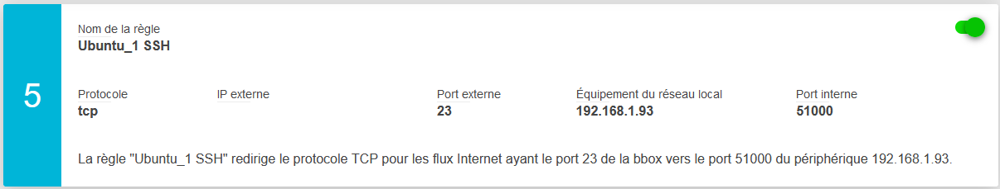
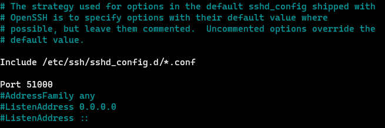

Connexion SSH
#############

Introduction
============

Les connections au serveur s'exécute via un terminal en utilisant ``le protocole ssh`` (**Secure Shell**) qui et a la fois 
un programme de communication et un protocole de connexion.

De base la connection ssh et automatiquement créer sur le port 22, tout fois pour des raison de sécurité 
il est préconiez de le changer.

Connexion au serveur
====================

.. code-block:: ps1
    :linenos:

    ssh <username>@<adresse IP> -p <numero de port>

- username et le nom de connexion. 
  De base en ce connectant sur un serveur tout n'est pas autorisé, des droits 
  sont octroyé par l'administrateur du serveur.
- adresse IP et l'adresse du serveur. Il peut étre local avec une adresse de
  type ``192.168.x.xx`` ou distance ``178.189.x.xx``. 
  L'adresse distance nécessite une configuration du routeur avec le mapping pour 
  la redirection des requêtes entrantes.
- Le numero de port et le numero autorisé avec connection SSH. Si le port est changer vous devez précisé l'option -p
  si non vous n'avez pas mettre le ``-p`` et la connection ce feras automatiquement 
  sur le port 22.

Configuration router
====================

Pour pourvoir ce connecter à distance, il faut que le port de redirection soit paramétré.
Dans cette exemple, une redirection de port a était créer via l’interface du router bbox. 
voir exemple ci-dessous.

Configuration port SSH
======================
Pour changer sont port ssh, il faut connaitre le port de configuration du serveur

.. code-block:: ps1
    :linenos: 

    sudo netstat -tulnp | grep ssh

Ouvrir le fichier ``sshd_config`` avec votre éditeur de text préféré (**nano**) ,
puis modifier le port de connexion au port voulut ici sera le port 51000. 

.. code-block:: ps1
    :linenos: 

    sudo nano /etc/ssh/sshd_config

Une l'optération réaliser, il faut relancer le service en utilisant la commande 
suivant.

.. code-block:: ps1
    :linenos: 

    systemctl restart sshd

Liste des ports de connexion
============================
Pour la connenction au Nas synology qui héberge la machine virtuelle Ubuntu_1 

.. code-block:: ps1
    :linenos:

    ssh maxime@black_hole -p22

Pour la connexion le serveur depuis de réseau local 

.. code-block:: ps1
    :linenos: 

    ssh maxime@192.168.1.93  -p51000

Pour la connexion au serveur depuis de réseau distant 

.. code-block:: ps1
    :linenos:

    ssh maxime@176.136.60.156 -p23