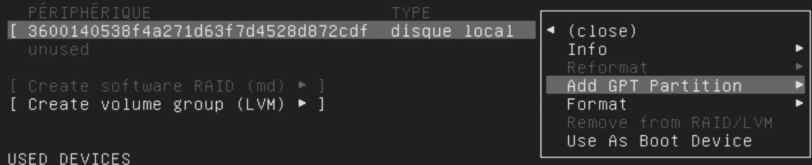

1. Installation du serveur Ubuntu
#################################

1. Installation
=============

Introduction
--------------

Sur le Nas il faut stocker l’iso du server, il faut qu’il soit ajouté dans le 
système de virtualisation du serveur (Virtual Machine Manager) Nas dans la section 
image. Une fois cette image ajouter, dans la partie Machine virtuelle de Virtual 
Machine Manager vous pouvez créer votre serveur virtuel.

Une fois créer cliquer sur connection et suivez les étapes de création :

-	Choisissez la langue
-	La disposition du clavier et sa variante
-	Connection réseaux laisse l’adresse locale il faut une adresse type 192.168.1.xx, si vous n’avez pas ce genre d’adresse vous ne pourrez pas vous connectez en ssh.
-	Adresse du proxy ne rien mettre
-	Mirror adresse laisse comme sa
-	Guide Storage Configuration sélectionner la partie Custom Storage Layout pour créer une partition swap pour le serveur. 

Pour créer une partition swap , suivre l’exemple ci-dessous

1. Partition swap 
-----------------
Pour créer une partition swap , suivre l’exemple ci-dessous

Puis dans le menu de création de partition faire ci-dessous

2. Partition root
-----------------
Après avoir ajouté la partition swap, il nous faut créer la partition root pour le système de la manière suivant.

Si vous voulez laisser tout l’espace pour la partition principale avec le format du fichier ext4 
à la racine du future serveur, alors faire comme sur l’image.

.. image:: ../image/ubuntu_partition_4.png
    :width: 800
    :alt: image partition swap Ubuntu serveur n°4

Résultat finale avant validation

Résultat finale avant validation

.. image:: ../image/ubuntu_partition_6.png
    :width: 800
    :alt: image partition swap Ubuntu serveur n°6

Il ne reste plus qu'a :

- Configurer un profile utilisateur (avant ou aprés l'installation)
- Installer ``open ssh`` (pour pouvoir vous connectez pas la suite) puis importer vos clef ssh depuis GitHub, sélectionné allow password authentication over ssh 
- Installer si vous desirez des fonctionnalité snap ou les outils dont vous avez besoin.Si vous n'etez pas sur de ce que vous voulez,
  vous pourrez toujours les installer par la suite.

Et voila, lancer l’installation du serveur.

2. Versionning Système
======================

`etckeeper <https://ubuntu.com/server/docs/tools-etckeeper>`_  est un système conçu pour suivre la configuration d'une machine 
(répertoire /etc, d'où le nom) à l'aide d'un gestionnaire de versions (par exemple Git).

Par défaut, etckeeper validera quotidiennement les modifications apportées au repertoire ``/etc``.etckeeper a été conçu par Joey Hess, 
développeur Debian émérite, et est donc pensé pour s'intégrer à Debian : les modifications liées à l'installation ou à 
la suppression d'un paquet sont enregistrées automatiquement mais peut être aussi utilisé manuellement.

Ce mécanisme permet de connaître très rapidement les modifications qui ont été faites par rapport à la configuration originale 
des paquets installés.

Placer ``/etc`` sous contrôle de version est considéré comme une bonne pratique de l'industrie, 
et l'objectif d'etckeeper est de rendre ce processus aussi simple que possible.

1. Installation EtcKeeper
--------------------------

La commande reste simple procédé comme suite 

.. code-block:: bash
    :linenos: 

    sudo apt-get install etckeeper

Le fichier de configuration principal, /etc/etckeeper/etckeeper.conf, est assez simple. Par défaut, etckeeper est configuré pour utiliser 
Le référentiel ``git``, il initialisé automatiquement(et validé pour la première fois) lors de l'installation du package. 
Pour `plus d'info <https://ubuntu.com/server/docs/tools-etckeeper>`_ sur la configuration.

1. List de commande 
-------------------

Linux man page `ici <https://linux.die.net/man/8/etckeeper>`_

.. code-block:: bash
    :linenos: 

    sudo etckeeper commit
    sudo etckeeper vcs status
    sudo etckeeper vcs diff
    sudo etckeeper vcs log
    sudo etckeeper unclean

