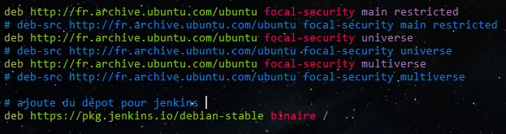
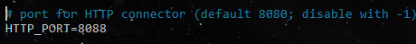
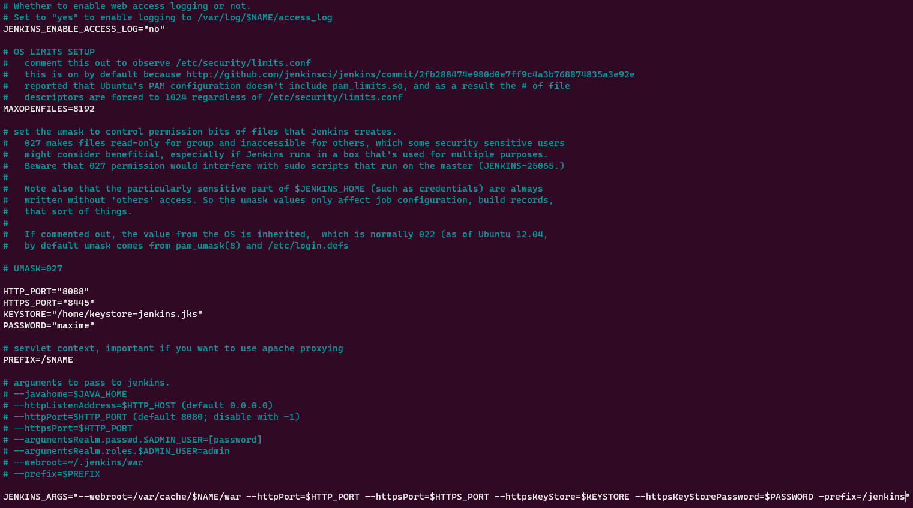

4. Jenkins
##########
Installation 
============
Introduction
-------------
Pour installer Jenkins, aller sur le site de jenkins recherche et prendre la version corespondant 
au système d’exploitation.

En premiere lieu, verifier la version de la JVM 

.. code-block:: bash
    :linenos:

    sudo java -version 

Puis du JDK du kid de développement

.. code-block:: bash
    :linenos:

    sudo javac version

Pour l’insatllation, Il faut ajouter le référentiel de paquets Debian de Jenkins pour automatiser 
l'installation et la mise à niveau. 
Pour utiliser ce référentiel, ajoutez d'abord la clé à votre système.

.. code-block:: bash
    :linenos:

    wget -q -O - | sudo apt-key add –

Ajoutez ensuite dans le fichier ``sources.list`` 

.. code-block:: bash
    :linenos:

    sudo nano /etc/apt/sources.list

La ligne suivant

.. code-block:: bash
    :linenos:

    deb https://pkg.jenkins.io/debian-stable binary/

Puis Mettez à jour votre index de package local, puis installez enfin Jenkins

.. code-block:: bash
    :linenos:

	sudo apt-get update
	sudo apt-get install jenkins

Vérifier que le service jenkins et en cour d’exécution.

.. code-block:: bash
    :linenos:

	sudo systemctl status jenkins

1. Gestion du port 
-------------------

Une fois jenkins installer changer le port de connection.

.. code-block:: bash
    :linenos:

	sudo nano /etc/default/jenkins

Mettre le port voulut, dans cette exemple j’ai mis le port 8088. 
Après avoir changer le port de connection il faut redémarrer Jenkins.

.. code-block:: bash
    :linenos:

	sudo systemctl restart jenkins

Ouvré un navigatreur puis entre l’adresse IP de jenkins : ``192.168.1.xx:8088``

Sur la fenêtre de jenkins, la procédure de déblocage et lancer. Il faut juste aller dans le 
repertoir demander puis copier le mot de passe de jenkins puis le coller dans l’endroit demander.
Il reste plus qu’a installer les plugin et entre votre nom , mot de passe user.

Pour le port HTTPS , ouvrir au niveau du feu le port par exemple 8445 pour le https de jenkins.

2. Gestion du pare-feux
------------------------

1. Autorisation du pare-feux avec la commande 
2. Ouvrir le port 8445

.. code-block:: bash
    :linenos:

    sudo ufw status
    sudo ufw allow 8445/tcp 

Puis dans le fichier jenkins ajouté le point de terminaison suivant ``JENKINS_ARGS``

