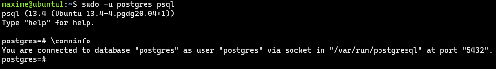
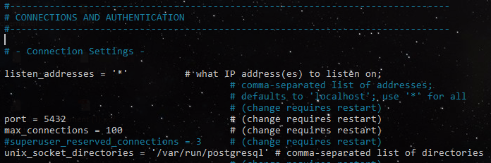
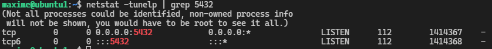
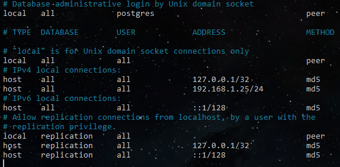

3. PostgreSQL
#############

Installation 
============

Introduction
--------------

PostgreSQL est un système de gestion de base de données relationnelle objet (SGBD) 
open source très populaire créé pour garantir la fiabilité, l'efficacité et l'intégrité 
des données. Le travail de développement dure maintenant plus de 30 ans et le projet lui 
a valu une solide réputation de fiabilité, de robustesse des fonctionnalités et de performances. 
Dans ce tutoriel, nous expliquerons comment installer et configurer le serveur de base de 
données PostgreSQL 13 sur un serveur Linux Ubuntu 20.04 | 18.04.

PostgreSQL est utilisé par des milliers d'entreprises pour alimenter les transactions de paiement,
le trafic énorme de sites Web, les plates-formes de commerce électronique, etc.
Il vous permet également d'ajouter des fonctions personnalisées développées à l'aide de langages 
de programmation tels que Java, Python, C / C ++ et bien d'autres.

À partir de cet article, la dernière version de PostgreSQL est 13, destinée à être utilisée pour 
exécuter des charges de travail dans des environnements de production. 
Vous pouvez trouver des informations sur toutes les fonctionnalités et modifications trouvées 
dans PostgreSQL 13 dans les notes de  `publication <https://www.postgresql.org/docs/13/release-13.html>`_

1. Mettre à jour le serveur Ubuntu
-----------------------------------------

Nous travaillons toujours sur une dernière version du système d'exploitation pour nous assurer qu'il n'y 
a pas d'anciens problèmes de dépendance. Connectez-vous à votre serveur Ubuntu et exécutez les commandes 
suivantes pour mettre à jour tous les packages installés.

.. code-block:: bash
    :linenos:

        sudo apt-get update
        sudo apt-get -y upgrade

Une fois le système mis à jour, je vous recommande d'effectuer un redémarrage pour que le 
nouveau noyau fonctionne s'il a été mis à jour.

.. code-block:: bash
    :linenos:

    sudo reboot

2. Ajouter le référentiel PostgreSQL 13 à Ubuntu 20.04 | 18.04
----------------------------------------------------------------------------

Maintenant que nous avons mis à jour et redémarré notre système, 
ajoutons le référentiel APT requis pour extraire les packages du référentiel PostgreSQL.

.. code-block:: bash
    :linenos:

    sudo apt -y install vim bash-completion wget
    wget --quiet -O - https://www.postgresql.org/media/keys/ACCC4CF8.asc | sudo apt-key add –

Apres avoir excuté cette commande si la clef a bien était ajouté un message OK sera afficher.
Après avoir importé la clé GPG, ajoutez le contenu du référentiel à votre système Ubuntu 20.04 | 18.04:

.. code-block:: bash
    :linenos:

    echo "deb http://apt.postgresql.org/pub/repos/apt/ `lsb_release -cs`-pgdg main" |sudo tee  /etc/apt/sources.list.d/pgdg.list

Le référentiel ajouté contient de nombreux packages différents, y compris des addons tiers. 
Ils comprennent:

- postgresql-client
- postgresql
- libpq-dev
- postgresql-serveur-dev
- packages pgadmin

3. Installez PostgreSQL 13 sur Ubuntu 20.04 / 18.04 Linux
---------------------------------------------------------
Avec l'ajout du référentiel, nous pouvons installer les packages PostgreSQL 13 sur notre 
serveur Linux Ubuntu 20.04 | 18.04. 
Mais mettez d'abord à jour l'index du package pour que la version soit disponible au niveau 
du système d'exploitation.

.. code-block:: bash
    :linenos:

    sudo apt-get update

Exécutez les commandes ci-dessous pour installer PostgreSQL 13 
sur Ubuntu 20.04 | 18.04 Système Linux.

.. code-block:: bash
    :linenos:

    sudo apt install postgresql-13 postgresql-client-13

Le service PostgreSQL est démarré et configuré pour apparaître 
après chaque redémarrage du système.

4. Renseignement sur postgresql
-------------------------------

Connaitre l’état de postgresql

.. code-block:: bash
    :linenos:

    systemctl status postgresql.service
    systemctl status postgresql@13-main.service

Recherche le path de postgres 

.. code-block:: bash
    :linenos:

    sudo find /usr -wholename '*/bin/postgres'

La version de Postgresql 

.. code-block:: bash
    :linenos:

    psql –version

5. Tester la connexion PostgreSQL dans le terminal
---------------------------------------------------

Lors de l'installation, un utilisateur postgres est créé automatiquement. Cet utilisateur 
dispose d'un accès superadmin complet à l'ensemble de votre instance PostgreSQL. Avant de passer 
à ce compte, votre utilisateur système connecté doit disposer des privilèges ``sudo``

.. code-block:: bash
    :linenos:

    sudo su postgres

Réinitialisons ce mot de passe utilisateur à un mot de passe fort dont nous pouvons nous souvenir`. 

.. code-block:: bash
    :linenos:

    psql -c "ALTER USER postgres WITH PASSWORD [M@xime1982]";

Puis de ce connecter avec le Role ``postgres`` à la base de données Postgresql 
en utilisant la commande ``psql``

.. code-block:: bash
    :linenos:

    sudo -u postgres psql

Pour obtenir des détailles sur votre connection.

.. code-block:: bash
    :linenos:

    \conninfo

Créons une base de données

.. code-block:: bash
    :linenos:

    CREATE DATABASE <'name data base'> ;

Puis créer un utilisateur avec un mot de passe 

.. code-block:: bash
    :linenos:

    CREATE USER <'user name'> WITH ENCRYPTED PASSWORD <'password user'> ;

Donnée des privilége dans la base de données blog a maxime

.. code-block:: bash
    :linenos:

    GRANT ALL PRIVILEGES ON DATABASE blog to <user name>;

Pour `ici un lien PostgreSQL Version 9 <https://doc.postgresql.fr/9.3/user-manag.html>`_ 
qui permettra d'avoir quelque commande.

1. Configuration pour la connexion distante 
-------------------------------------------
L'installation de PostgreSQL 13 sur Ubuntu n'accepte que les connexions de l'hôte local. 
Dans les environnements de production idéaux, vous aurez un serveur de base de données 
central et des clients distants qui s'y connectent - mais bien sûr au sein d'un 
`réseau privé  (LAN) <https://www.ionos.fr/digitalguide/serveur/know-how/lan/>`.

Pour **activer les connexions à distance**, modifiez le fichier de configuration PostgreSQL

.. code-block:: bash
    :linenos:

    sudo nano /etc/postgresql/13/main/postgresql.conf

Décommentez la ligne  59  et modifiez l'adresse d'écoute pour accepter les connexions 
au sein de vos réseaux.

Si voulez restreindre à une ou plusieurs adresses spécifiques mettre comme suite. Dans cette
exemple on restreint à certain adresse du reseau local. 

.. code-block:: bash
    :linenos:

    '127.0.0.1, 192.168.x.x'

Après la modification, redémarrez le service postgresql.

.. code-block:: bash
    :linenos:

    sudo systemctl restart postgresql
    sudo systemctl status postgresql 

Confirmer le port d’écoute `5432`

.. code-block:: bash
    :linenos:

    netstat -tunelp | grep 5432 

Ajouter une entré d’authentification client au fichier pg_hba.conf

Par défaut, PostgreSQL accepte uniquement les connexions provenant de localhost (hôte local). 
Il refuse les connexions à distance. 
Cela est contrôlé par l'application par règle de contrôle 
d'accès qui permet à un utilisateur de se connecter à partir d'une adresse IP après avoir 
entré un mot de passe valide (mot clé md5).

Pour accepter une connexion à distance, ajoutez l'entrée suivante au fichier.

.. code-block:: bash
    :linenos:

    sudo nano /etc/postgresql/13/main/pg_hba.conf

En résumer, il faut permettre à postgres qu'il puisse écoute sur tout les ports via le fichier 
`postgresql.cong` puis autorisé la connection avec le fichier `pg_hba.conf`.

Il faut préferé le format d'encryptage `md5` qui permet le chiffrage de la connection entre le 
client et la base de données a `trust` (trust = confiance) qui suppose que la connexion 
est de confiance mais n'est pas sécurisé (peux étre utilisé dans un réseau ne nécessitant 
pas particulairement de sécurité).

Commande PostgreSQL
===================

Preambule
----------

PostgreSQL™ gère les droits d'accès aux bases de données en utilisant le concept de rôles. 
Un rôle peut être vu soit comme un utilisateur de la base de données, soit comme un groupe 
d'utilisateurs de la base de données, suivant la façon dont le rôle est configuré. 
Les rôles peuvent posséder des objets de la base de données (par exemple des tables) et peuvent 
affecter des droits sur ces objets à d'autres rôles pour contrôler qui a accès à ces objets. 
De plus, il est possible de donner l'appartenance d'un rôle à un autre rôle, l'autorisant du coup 
à utiliser les droits affectés à un autre rôle.

Le concept des rôles comprends les concepts des « utilisateurs » et des « groupes ». 
Dans les versions de `PostgreSQL™` antérieures à la 8.1, Les utilisateurs et les groupes étaient 
des types d'entité distincts mais, maintenant, ce ne sont que des rôles. 
Tout rôle peut agir comme un utilisateur, un groupe ou les deux.

1. Gestion des Rôles
---------------------

Un rôle est une entité qui peut posséder des objets de la base de données et avoir des droits 
sur la base et ses objets.Il peut être considéré comme un « utilisateur », un « groupe » 
ou les deux suivant la façon dont il est utilisé.

`Le Chapitre 21 <https://docs.postgresql.fr/10/user-manag.html>`_ et `le Chapitre 20 <https://docs.postgresql.fr/10/client-authentication.html>`_ 
donnent de plus amples informations sur la gestion des utilisateurs et l'authentification.

Il est nécessaire de posséder le droit `CREATEROLE` ou d'être `superutilisateur` pour utiliser 
cette commande.

`CREATE USER` est équivalent à `CREATE ROLE` sauf que `CREATE USER` utilise `LOGIN` 
par défaut alors que `CREATE ROLE` ne l'utilise pas.

`Information sur la création de Role <https://www.postgresql.org/docs/current/sql-createrole.html>`_

1. Création d'un `ROLE` avec option `LOGIN` :
   Un rôle ayant l'attribut `LOGIN` peut être considéré comme un utilisateur. 
   Les rôles sans cet attribut sont utiles pour gérer les privilèges de la base de données, 
   mais ne sont pas des utilisateurs au sens habituel du terme. 
   S'il n'est pas spécifié, `NOLOGIN` est la valeur par défaut, sauf lorsque `CREATE ROLE` 
   est invoqué via son orthographe alternative `CREATE USER`.

2. Création d'un `ROLE` avec option `PASSWORD` :
   Permet l'authentification par mot de passe.

.. code-block:: bash
    :linenos:

    CREATE ROLE <'role name'> LOGIN;
    CREATE ROLE <'role name'> WITH PASSWORD <'password role'>;

1. Création d’un utilisateur (rôle) avec mot de passe 
2. Autoriser le rôle à se connecter 

.. code-block:: bash
    :linenos:

    CREATE ROLE <'role name'> WITH PASSWORD <'password role'>;
    alter role <'name role'> LOGIN ;

Modification du mot de passe concernant le rôle

.. code-block:: bash
    :linenos:

    alter role <'name role'> with password <'password role'>;
    alter role application with encrypted password <'new password'>;

Affecter les droits à une base de donnée (tous les privilèges) 

.. code-block:: bash
    :linenos:

    grant all privileges on database mabase to <'name role'>

Affecter les droits à un ou plusieurs schema 

.. code-block:: bash
    :linenos:

    grant all privileges on schema public, private to <'name role'>

Affecter les droits aux objets 

.. code-block:: bash
    :linenos:

    grant all privileges on all functions in schema public, private to <name role>
    grant all privileges on all tables in schema public, private to <name role>
    grant all privileges on all sequences in schema public, private to <name role>

convertir en ``supersuer``  

.. code-block:: bash
    :linenos:

    alter user <'name role'> with superuser

Supprimé le ``supersuer`` 

.. code-block:: bash
    :linenos:

    alter user <'name role'> with nosuperuser

2. Gestion d'une base de données et de ses droits 
--------------------------------------------------

Pour ce faire, il faut créer une base de données en indiquant le `Owner` (propriétaire) , 
si le Owner n’est pas spécifier, c’est le user par défaut qui en serai le responsable.

.. code-block:: bash
    :linenos:

    CREATE DATABASE <'name db'> OWNER <'username'> ;

Pour changer de propriétaire de la base de 

.. code-block:: bash
    :linenos:

    ALTER DATABASE <'name db'> OWNER TO <'new username'>;

Supprimer tout les droits des autre utilisateur d’une base de données

.. code-block:: bash
    :linenos:

    REVOKE ALL ON DATABASE <'name db'> FROM PUBLIC ;

1. Liste de commande Postgresql pour le terminal 
------------------------------------------------

Lorsque nous avons installé PostgreSQL, il a créé un utilisateur de système d’exploitation 
nommé et un utilisateur de base de données également nommé avec une méthode de connexion d
éfinie comme . Cela signifie que nous ne pouvons nous connecter à l’utilisateur PostgreSQL 
qu’à partir de notre utilisateur os. Et pour cela, nous pouvons exécuter la commande suivante.

NB: Postgresql et la fois un utilisateur et une base de données.

.. code-block:: bash
    :linenos:

    sudo -u postgres psql -U postgres -d [db name]

Connection rapide sur la base de données postgres avec l'utilisateur postgres

.. code-block:: bash
    :linenos:

    sudo -u postgres psql

.. code-block:: bash
    :linenos:

    \l      = liste les des bases données
    \dn     = liste les schémas
    \dt     = liste les types de données

.. code-block:: bash
    :linenos:

    \di     = liste des index
    \dd     = liste les objets du Type contrainte, classe d\'opérateur, famille d\'opérateur, règle et trigger.
    \df     = liste les fonctions 2 sur 4

.. code-block:: bash
    :linenos:

    \du     = Liste les rôles de la base de données
    \dg     = idem
    \dp     = Liste les tables, vues et séquences avec leur droits d\'accès associés.

.. code-block:: bash
    :linenos:

    \db     = Liste les tablespaces (objets globaux : pgdefault, pgglobal)
    \dx     = Affiche les extensions installées. (postgis, plpgsql) (voir unaccent, pgstatstatements)

.. code-block:: bash
    :linenos:

    \?              = Affiche l\'aide psql
    \h              = Liste les commandes SQL
    \q              = quitter psql 
    \c <'name db'>  = changement de base de données

 

Ce tutoriel a était créer appartir de 
`celui-ci <https://computingforgeeks.com/how-to-install-postgresql-13-on-ubuntu/>`_