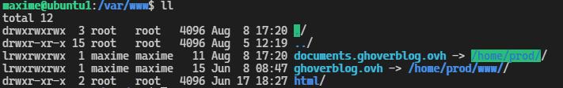
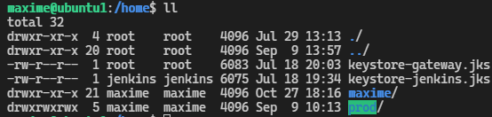
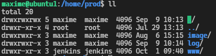
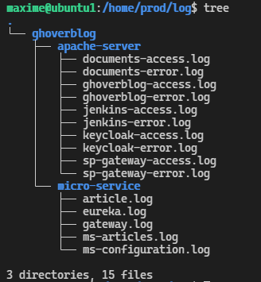
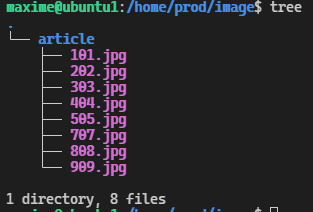
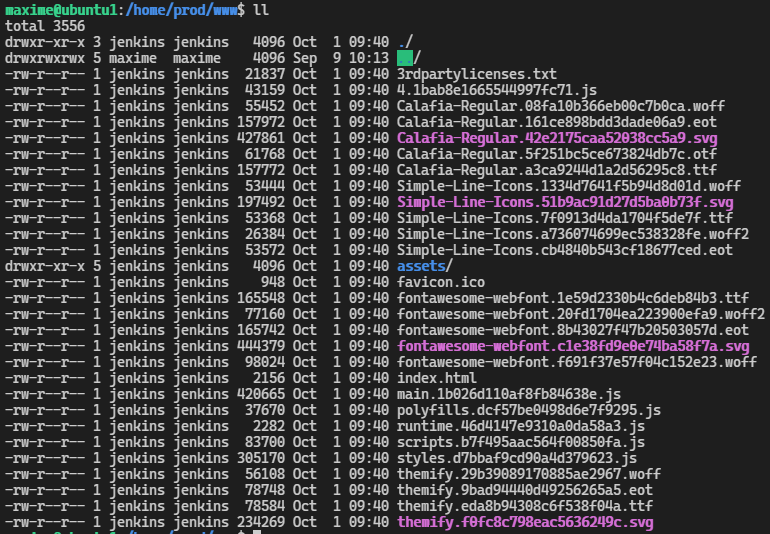

7. Production
#################

L'organisation des fichiers
---------------------------

1. Les repertoires 
======================

Dans le but de séparer les élements de la production,
    j'ai créer dans le repertoire ``/Home`` 
    du serveur tout les dossier et sous-dossier ou seront déployer les applications Front-end, Back-end et les log du projet ``ghoverblog``

    Apache serveur permet via sa configuration d'activé des modules, d'active des configurations
    qui permettré de connecter un ou plusieurs site internet qui ce trouveraient sur le serveur hébergeur.
    Ces site pourraient étre activé ou déactivé a volonté via le mécanisme de lien symbolique qui permet 
    en le suppriment ou en l'ajoutent de mettre en ligne le dit site internet. 

    Cela peut être utile lorque vous voulez rediregé le flux des requêtes pendant que le site est 
    maintenace par exemple. Sur la machine virtuelle qui heberge le site ``ghoverblog`` cette technique
    est utilisé.

Sur cette image vous pouvez voir tout les lien de redirection qui pointe vers les sources.

Ce répertoire est liéer au super utilisateur du system le ``root``.

Dans le repertoir ``/Home/prod/`` a était créer :
- Le dossier image, pour le stockage des images du server qui seront 
accessible depuis l'extérieur de l'application.
- Le dossier log, pour les log du serveur apache et des micro-services Spring
- Le dossier www, qui contient l'application front-end ghoverblog 

Aperçut des dossier suivant 

.. code-block:: bash
    :linenos:

    /home/prod/log
    /home/prod/image
    /home/prod/www

   