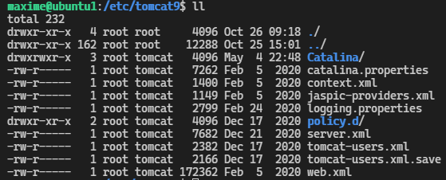

6. Tomcat
#################

Préambule
----------

Cette parti de documentation a était réaliser dans le but de mettre en service un site internet possédant une
architecture de type monolytique en java. 

Cette solution a était abandonné au profit d'une architecture micro-service qui permet 
`la scalbilité <https://www.appvizer.fr/magazine/operations/business-plan/scalabilite>`_ de l'application.

Tout fois, la gestion d'un serveur tomcat est toujours utilsé est trés intéressante a utilisé. 
C'est pourquoi, je vais présenté tout les actions réalisé sur le 1er projet blog.  

Installation de tomcat sur Ubuntu server
----------------------------------------

L'installation de tomact sur serveur Ubuntu peut ce fair de plusieur maniére.
Soit en téléchargement de tomcat sur le site d'apache ou soit via les dépots 
apt mise a disposition via le terminal linux.

Recherche des version de tomcat dans les dépots

.. code-block:: bash
    :linenos:

    sudo apt-cache search tomcat 

.. code-block:: bash
    :linenos:

    sudo apt install tomcat9 tomcat9-admin

Configuration du module jk 
---------------------------

Pour réceptionné les requêtes venant de l'extérieur vers le serveur tomact 
nous devons paramétre le module jk qui feras le forwarding vers le serveur
tomcat. 

Pour cela nous devons configurer tomact pour qu'il reception les requêtes 
que serveur Proxy apache lui retourne.

Voici le repertoir tomcat ou ce situe les fichier de configuration

.. code-block:: bash
    :linenos:

    /etc/tomcat9

