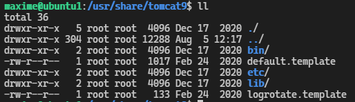

6. Tomcat
#################

Préambule
----------

Cette parti de documentation a était réaliser dans le but de mettre en service un site internet possédant une
architecture de type monolytique en java. 

Cette solution a était abandonné au profit d'une architecture micro-service qui permet 
`la scalbilité <https://www.appvizer.fr/magazine/operations/business-plan/scalabilite>`_ de l'application.

Toute fois, la gestion d'un serveur tomcat est toujours utilsé est trés intéressante a utilisé. 
C'est pourquoi, je vais présenté tout les actions réalisé sur le 1er projet blog.  

Installation de tomcat sur Ubuntu server
----------------------------------------

L'installation de tomact sur serveur Ubuntu peut ce fair de plusieur maniére.
Soit en téléchargement de tomcat sur le site d'apache ou soit via les dépots 
apt mise a disposition via le terminal linux.

Recherche des version de tomcat dans les dépots

.. code-block:: bash
    :linenos:

    sudo apt-cache search tomcat 

Puis pour l'installation entré :

.. code-block:: bash
    :linenos:

    sudo apt install tomcat9 tomcat9-admin

Aprés l'installation vérifier l’ouverture du port 8080 avec la commande suivant.
Elle permet de voir tout les port d'écoute du serveur en activité.

.. code-block:: bash
    :linenos:

    ss -ltn

Quelque commande de gestion
-----------------------------

.. code-block:: bash
    :linenos:

    sudo systemctl status tomcat9
    sudo systemctl restart tomcat9
    sudo systemctl stop tomcat9
    sudo systemctl start tomcat9

Pour sortir du terminal utilsé `le ctrl + z`

Liste des repertoires
-----------------------

Voici le repertoir tomcat ou ce situe les fichiers de configuration

.. code-block:: bash
    :linenos:

    cd /etc/tomcat9

.. image:: ../image/ubuntu_tomact_fichier.png
    :width: 800
    :alt: image repertoire tomcat 9

.. code-block:: bash
    :linenos:

    cd /usr/libexec/tomcat9 

.. code-block:: bash
    :linenos:

    cd /usr/share/tomcat9 

    
Le fichier webapps de tomcat ce trouve dans 

.. code-block:: bash
    :linenos:

    /var/lib/tomcat9/webapps

Les logs de tomcat

.. code-block:: bash
    :linenos:

    /var/log/tomcat9

.. image:: ../image/ubuntu_tomact_log.png
    :width: 800
    :alt: image repertoire log tomcat9

Les droits de connection 
---------------------------

Les droits de gestion de tomcat ce trouve dans le fichier tomcat-user.xml.
Ouvrir le fichier avec l'éditeur de texte ``nano``

.. code-block:: bash
    :linenos:

    sudo nano /etc/tomcat9/tomcat-users.xml

Ces droits vont permettre la connection à l’espace manager de l’interface graphique 
de tomcat avec les mots de passe inscrit ainsi que la gestion des scripts.

La gestion des scripts permet de pouvoir injecter un fichier compilé du format ``war``
par l’intermédiaire de script utilisé avec Maven et jenkins au travers de Maven.  

.. code-block:: bash
    :linenos:

    <?xml version="1.0" encoding="UTF-8"?>
    <!--
    Licensed to the Apache Software Foundation (ASF) under one or more
    contributor license agreements.  See the NOTICE file distributed with
    this work for additional information regarding copyright ownership.
    The ASF licenses this file to You under the Apache License, Version 2.0
    (the "License"); you may not use this file except in compliance with
    the License.  You may obtain a copy of the License at

        http://www.apache.org/licenses/LICENSE-2.0

    Unless required by applicable law or agreed to in writing, software
    distributed under the License is distributed on an "AS IS" BASIS,
    WITHOUT WARRANTIES OR CONDITIONS OF ANY KIND, either express or implied.
    See the License for the specific language governing permissions and
    limitations under the License.
    -->
    <-- Gestion des droits -->
    <tomcat-users xmlns="http://tomcat.apache.org/xml"
                xmlns:xsi="http://www.w3.org/2001/XMLSchema-instance"
                xsi:schemaLocation="http://tomcat.apache.org/xml tomcat-users.xsd"
                version="1.0">

    <role rolename="manager-gui"/>
    <role rolename="manager-script"/>
    <user username="root" password="root" roles="admin-gui,manager-gui" />
    <user username="cargo" password="cargo" roles="manager-script" />

    <!--
    NOTE:  By default, no user is included in the "manager-gui" role required
    to operate the "/manager/html" web application.  If you wish to use this app,
    you must define such a user - the username and password are arbitrary. It is
    strongly recommended that you do NOT use one of the users in the commented out
    section below since they are intended for use with the examples web
    application.
    -->
    <!--
    NOTE:  The sample user and role entries below are intended for use with the
    examples web application. They are wrapped in a comment and thus are ignored
    when reading this file. If you wish to configure these users for use with the
    examples web application, do not forget to remove the <!.. ..> that surrounds
    them. You will also need to set the passwords to something appropriate.
    -->
    <!--
    <role rolename="tomcat"/>
    <role rolename="role1"/>
    <user username="tomcat" password="<must-be-changed>" roles="tomcat"/>
    <user username="both" password="<must-be-changed>" roles="tomcat,role1"/>
    <user username="role1" password="<must-be-changed>" roles="role1"/>
    -->
    </tomcat-users>

Configuration du module jk 
---------------------------

Pour réceptionné les requêtes venant de l'extérieur vers le serveur tomcat 
nous devons paramétre le module jk qui feras le forwarding vers le serveur
tomcat. 

Pour cela nous devons configurer tomact pour qu'il reception les requêtes 
venant du serveur Proxy apache .

